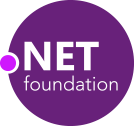

Title: About Me
OrderNumber: 1
---
# Welcome to Duracellko.NET

    

Hi, I am Rasťo. Welcome to my homepage, where I would like to share my projects, experiences and other interesting things.

I come from Bratislava, Slovakia. I studied software engineering at Faculty of Mathematics, Physics and Informatics at Commenius University in Bratislava. Then I improved my software development experience in different countries: Slovakia, Czech Republic, Philippines, and Singapore at the moment.

I am software engineer focused on Microsoft technologies especially development in [.NET](https://dotnet.microsoft.com/) and C#. I am experienced in development of Windows applications, web applications, enterprise systems, mobile applications and SQL and NoSQL databases. My current focus is mastering DevOps with [Azure DevOps](https://azure.microsoft.com/services/devops/), [Microsoft Azure](https://azure.microsoft.com/) solutions and [Docker](https://www.docker.com/).

You can find few of my private projects at  [GitHub](https://github.com/duracellko). And I share my experiences at Twitter  [@duracellko](https://twitter.com/duracellko) and my [development blog](/). And recently I became member of [.NET Foundation](https://dotnetfoundation.org/).

My certificates:
* Certified SAFe Agilist (2018)
* Certified ScrumMaster (Scrum Alliance, 2015)
* MCTS .NET Framework 4, Web Applications
* MCTS .NET Framework 4, Data Access
* MCPD Web Developer
* MCTS .NET Framework 2, Web Applications
* MCAD Microsoft.NET

In last years I got impressed by photography and I try improving slowly in this hobby. Additionally I like mountain biking, inline-skating, billiard.

