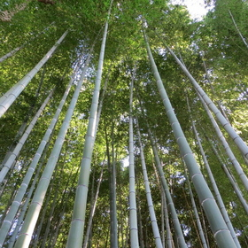
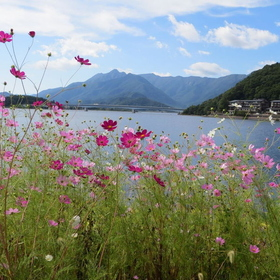
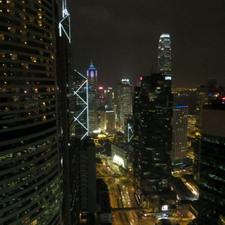

Title: Photography
OrderNumber: 4
---
Few years ago I got impressed by photography. Mostly photographs of landscapes and nature, but also other interesting places or photos with interesting atmosphere. I started learning of some basics of photography, so at least I have some idea, what all those camera settings are. And now you can find my photos from wandering around the world at my [500px page](http://500px.com/duracellko). [500px](http://500px.com/) is quickly growing social network for professional and amateur photographs.

Currently I am owner of Canon PowerShot SX240 HS and sometimes I borrow from my sister Canon EOS 550D.

**[Enjoy collection of my photos...](http://500px.com/duracellko)**

